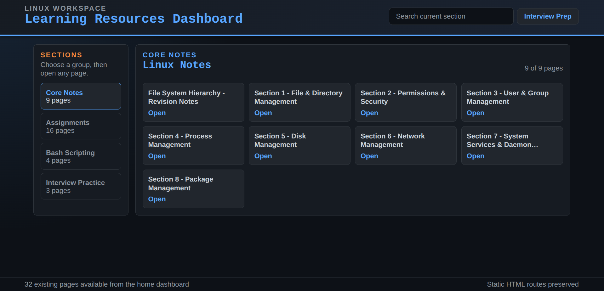

# Linux Learning Dashboard 🐧


🌐 Website: https://sairaj-25.github.io/Linux_Learning_Dashboard/

---

## 📖 Overview

Linux Learning Dashboard is designed to help students, beginners, and aspiring system administrators learn Linux concepts in a structured manner. The repository covers fundamental to advanced Linux administration topics with practical examples, assignments, and interview-focused content.

---

<p align="center">
  
</p>

## 🎯 Learning Objectives

By using this repository, you will learn:

* Linux file and directory management
* Filesystem permissions and security
* User and group administration
* Process management
* Disk and storage management
* Network configuration and troubleshooting
* System services and daemon management
* Package management
* Linux interview preparation


---

## 📚 Topics Covered

### 1. File and Directory Management

* Navigation commands
* File operations
* Directory management
* Search and filtering

### 2. Filesystem Permissions and Security

* chmod
* chown
* chgrp
* Special permissions
* Security best practices

### 3. User and Group Management

* User creation
* Password management
* Group administration
* Access control

### 4. Process Management

* ps, top, htop
* Process Priority – nice & renice
* Process Signals

### 5. Disk Management

* Partitions
* Mounting filesystems
* Disk monitoring
* Storage administration

### 6. Network Management

* IP configuration
* DNS management
* Network troubleshooting
* SSH administration

### 7. System Services and Daemon Management

* systemd
* service management
* logs and monitoring
* startup configuration

### 8. Package Management

* apt
* yum/dnf
* rpm
* software installation and updates

---

## 💻 Dashboard Features

* Interactive web-based learning dashboard
* Structured learning path
* Practical assignments
* Interview preparation materials
* Organized Linux concepts
* Easy navigation between topics

---

## 🚀 Getting Started

### Clone the Repository

```bash
git clone https://github.com/Sairaj-25/Linux_Learning_Dashboard.git
```

### Open the Dashboard

Navigate to the project directory and open:

```bash
index.html
```

in your web browser.

---

## 🎓 Recommended Learning Path

1. File and Directory Management
2. Filesystem Permissions and Security
3. User and Group Management
4. Process Management
5. Disk Management
6. Network Management
7. System Services and Daemon Management
8. Package Management
9. Interview Practice

---

## 📝 Assignments

Each section contains practical exercises to reinforce concepts through hands-on practice.

---

## 🎯 Interview Preparation

The repository includes:

* Linux interview questions
* System administration scenarios
* Command-based troubleshooting exercises
* Real-world use cases

---

## 🤝 Contributing

Contributions are welcome.

You can help by:

* Adding new Linux topics
* Improving explanations
* Fixing errors
* Creating additional assignments
* Enhancing dashboard functionality

---

## 📄 License

This project is intended for educational and learning purposes.

---

## 👨‍💻 Author

**Sairaj Jadhav**


---

⭐ If this repository helps you learn Linux, consider giving it a star.
